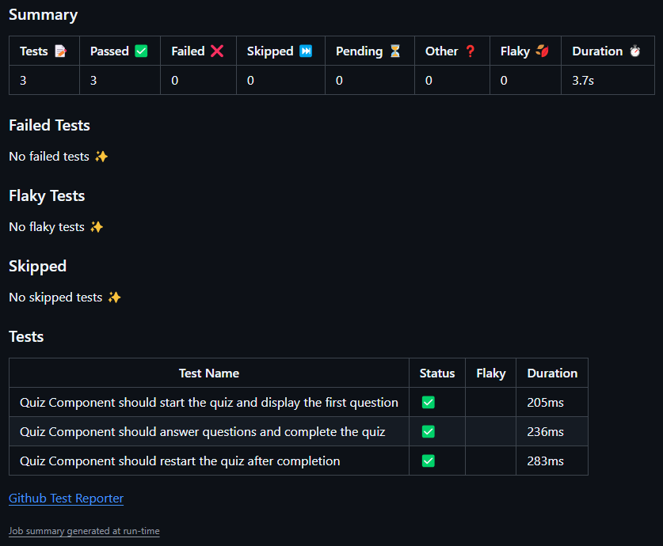

# Tech Quiz Test Suite - Github Actions CI/CD

## Description

This is the same tech quiz as in the module 19 challenge, supplied by edX - but this time my assignment was to set up GitHub Actions so that Cypress component tests are run automatically when a pull request is made to the `develop` branch, and the application is automatically deployed to Render when code is merged from `develop` to `main`.

## Table of Contents

- [Tech Quiz Test Suite - Github Actions CI/CD](#tech-quiz-test-suite---github-actions-cicd)
  - [Description](#description)
  - [Table of Contents](#table-of-contents)
  - [Screenshot](#screenshot)
  - [User Story](#user-story)
  - [Acceptance Criteria](#acceptance-criteria)
  - [Installation](#installation)
  - [Usage](#usage)
  - [Credits](#credits)
  - [License](#license)
  - [How to Contribute](#how-to-contribute)
  - [Tests](#tests)
  - [Questions?](#questions)

## Screenshot

## User Story

- AS A software engineer looking to integrate a CI/CD pipeline in a codebase
- I WANT a full-stack application that runs test cases when a Pull Request is made to the develop branch and automatically deploys to Render when the code is merged to main
- SO THAT I can ensure that all code integrations are clean and pass the proper requirements and that the application is constantly updated when major releases are made to the main branch

## Acceptance Criteria

- GIVEN a full-stack application
- WHEN I upload new features to the application
- THEN I should be making Pull Requests to a develop branch first
- WHEN I create a Pull Request to a develop branch
- THEN I should be executing a GitHub Action that checks the Cypress component tests
- WHEN I see that the tests pass on GitHub Action
- THEN I should see those test results on GitHub Action and merge the code
- WHEN I push the code from the develop branch to the main branch
- THEN I should see that another GitHub Action triggers and should automatically deploy to Render

## Installation

Download or fork repo. In the terminal, run "npm install" to install all required packages and "npm run build" to build the app.

## Usage

To run the supplied tests: fork the repo, add a `develop` branch using `git checkout -b develop`, make a small change (such as whitespace), and push the changes. Tests should automatically run. To run the deployment tests, you'll need to deploy the project on Render first, turn off "automatic deployment", and merge a pull request from `develop` into `main`.

## Credits

All code written by me, with help from several AI chatbots, incl. the edX AI chatbot, ChatGPT, and GitHub Copilot. Instructors, TA's, and classmate's time graciously donated when having issues.

## License

This project is licensed under the  [MIT](https://opensource.org/licenses/MIT) license.

## How to Contribute

No contributions needed at this time - but feel free to download, fork, use, and play with as desired.

## Tests

See above; [Usage](#usage) instructions.

## Questions?

Contact me at
[GitHub](https://github.com/k3strl), or email me at: <k3strl@geemail.com>.
